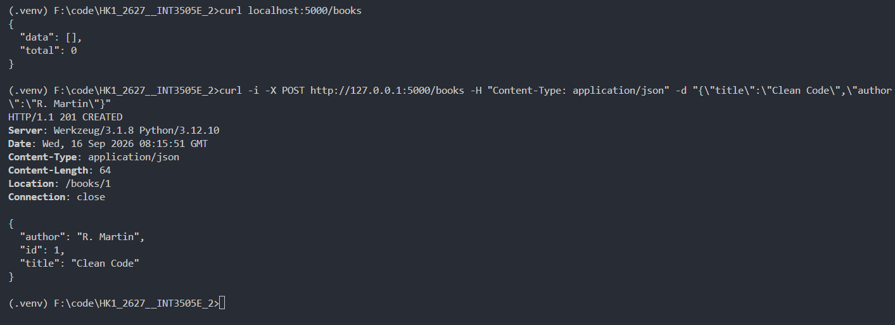
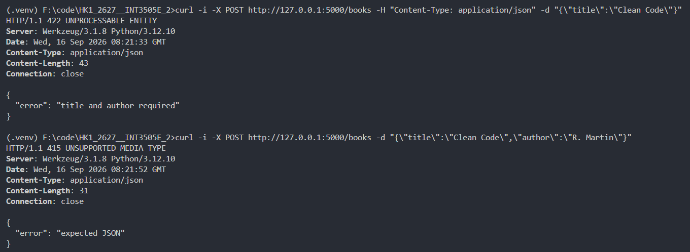
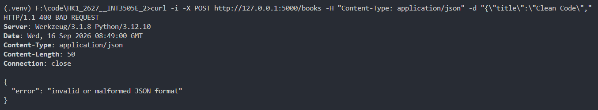
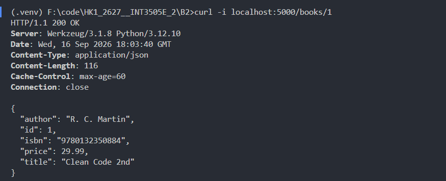
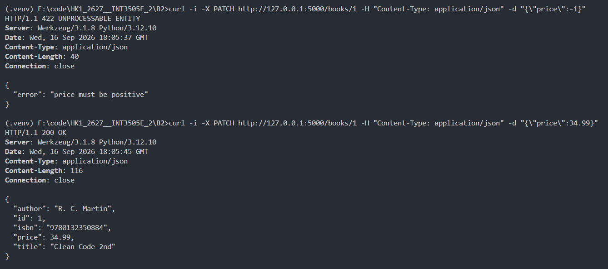
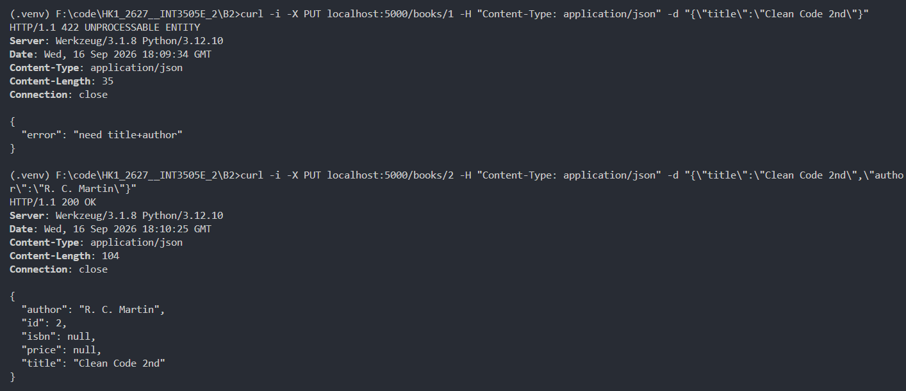
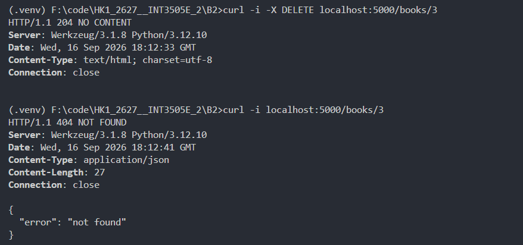
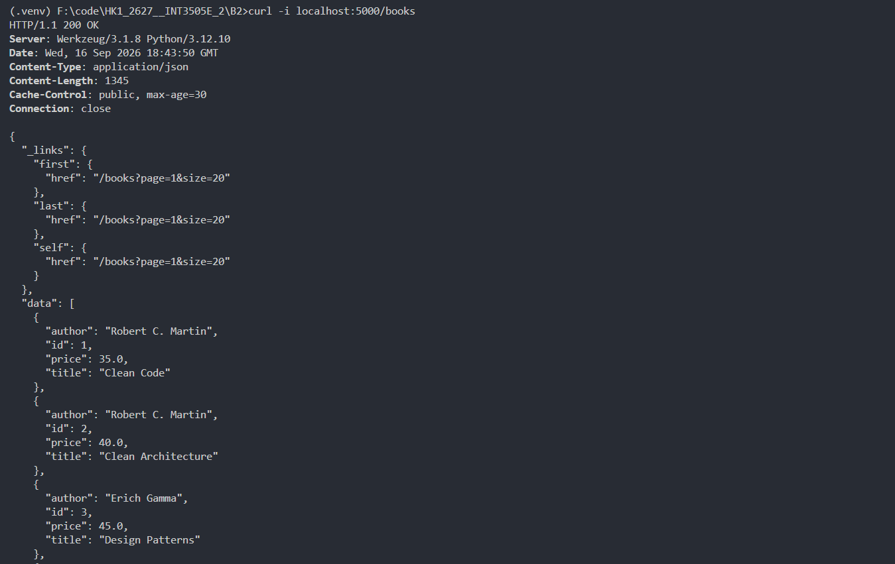

# BT Buổi 2

## Bài 1

**1. Lấy danh sách khi chưa có dữ liệu:**
- Trả về mã status 200 OK, phần body chứa data rỗng data: [] và total: 0

**2. Kiểm tra tạo sách mới thành công:**

- Trả về mã status 201 CREATED
- Header chứa Location: /books/1 dẫn tới tài nguyên vừa sinh

**3. Kiểm tra dữ liệu không đầy đủ (thiếu title/author):**
- Trả về mã lỗi 422 UNPROCESSABLE ENTITY {"error": "title and author required"}

**4. Kiểm tra thiếu header JSON:**
- Trả về mã lỗi 415 UNSUPPORTED MEDIA TYPE {"error": "expected JSON"}

**5. Kiểm tra sai JSON:**
- Trả về mã lỗi 400 BAD REQUEST {"error": "invalid or malformed JSON format"}

## Bài 2

**1. Kiểm tra lấy chi tiết tài nguyên và Cache-Control:**
- Trả về 200 OK, dữ liệu cuốn sách có id: 1 và header Cache-Control: max-age = 60

**2. Kiểm tra đầu vào của Price:**
- Trả về 422 UNPROCESSABLE ENTITY {"error": "price must be positive"}

**3. Kiểm tra thay đổi một phần PUT:**
- Trả về 200 OK, trường price được cập nhật thành 34.99, các thông tin còn lại (title, author, isbn) được giữ nguyên vẹn

**4. Kiểm tra thay thế toàn bộ tài nguyên PUT:**
- Trả về mã lỗi 422 UNPROCESSABLE ENTITY {"error": "title and author required"} nếu không đầy đủ cả title và author
- Trả về 200 OK, dữ liệu được cập nhật lại theo payload mới; các trường không gửi lên (isbn, price) bị gán giá trị null

**4. Kiểm tra xoá tài nguyên thành công DELETE:**
- Trả về mã 204 NO CONTENT với body hoàn toàn rỗng

**5. Kiểm tra xoá lại tài nguyên đã bị xoá:**
- Trả về mã lỗi 404 NOT FOUND cùng thông báo {"error": "not found"}

## Bài 3

